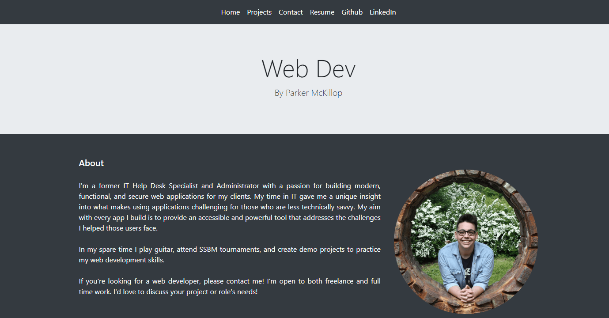

# React-Portfolio

## Description

This portoflio was written with react, as well the libraries Formik (form handling), email.js(email handling), and react-router-hash-link (handles  anchors and smooth scroll). I deviated from the challenge's design specifications because I preferred the single page look of the application without the singular component rendering. While I didn't use it extensively in this site, I am comfortable with the react router. I also did not include github and linkedin icons at the bottom. I reserved that space for a mailTo link with an svg icon. Instead I included external links to my github and linkedin in my navbar without icons to match the styling.

## Table of Contents

- [Installation](#installation)
- [Usage](#usage)
- [Questions](#questions)
- [License](#license)

## Installation

This project can be installed by cloning the repo, installing required dependencies, and running the command  \"npm start\".

## Usage

This project is intended as my web design portfolio. Users can read my about section, view my projects, and contact me through this application.

[https://parkermckillop.netlify.app](https://parkermckillop.netlify.app)

## Credits

## Contribution

## Tests

## Questions

[https://github.com/pem2k](https://github.com/pem2k)

[mckilpar000@hotmail.com](mailto:mckilpar000@hotmail.com)

## License
MIT License

Copyright (c) [2022] [Parker McKillop]

Permission is hereby granted, free of charge, to any person obtaining a copy
of this software and associated documentation files (the "Software"), to deal
in the Software without restriction, including without limitation the rights
to use, copy, modify, merge, publish, distribute, sublicense, and/or sell
copies of the Software, and to permit persons to whom the Software is
furnished to do so, subject to the following conditions:

The above copyright notice and this permission notice shall be included in all
copies or substantial portions of the Software.

THE SOFTWARE IS PROVIDED "AS IS", WITHOUT WARRANTY OF ANY KIND, EXPRESS OR
IMPLIED, INCLUDING BUT NOT LIMITED TO THE WARRANTIES OF MERCHANTABILITY,
FITNESS FOR A PARTICULAR PURPOSE AND NONINFRINGEMENT. IN NO EVENT SHALL THE
AUTHORS OR COPYRIGHT HOLDERS BE LIABLE FOR ANY CLAIM, DAMAGES OR OTHER
LIABILITY, WHETHER IN AN ACTION OF CONTRACT, TORT OR OTHERWISE, ARISING FROM,
OUT OF OR IN CONNECTION WITH THE SOFTWARE OR THE USE OR OTHER DEALINGS IN THE
SOFTWARE.
